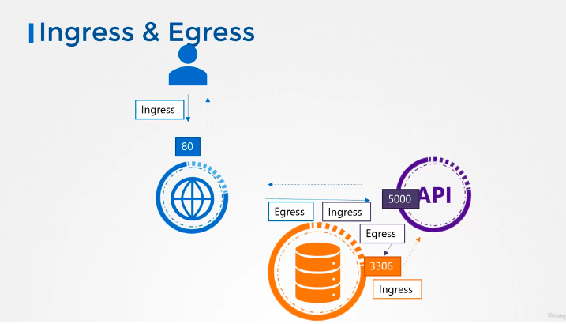
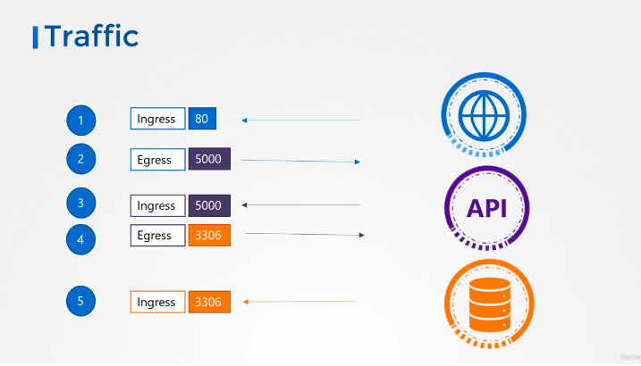
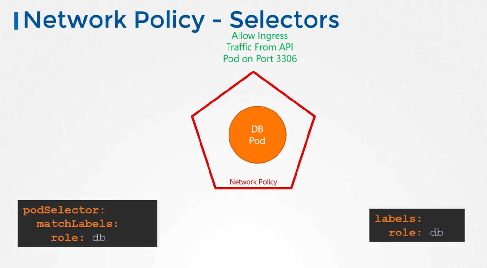
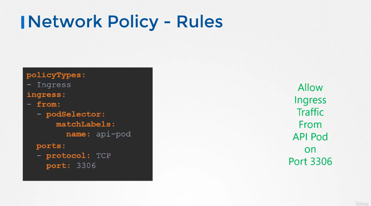
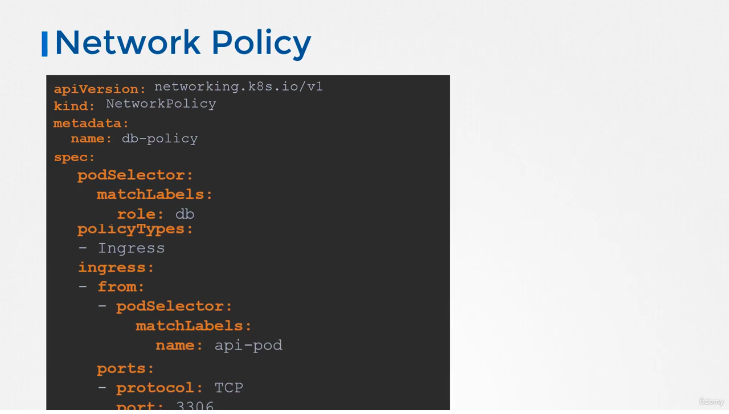

#### Network policies

Network policies is a k8s object that we create and associate it to a pod or a resource.

Network policies allow us to define network traffic rules within a kubernete cluster.

They are 2 policyTypes : `Ingress` and `Egress `

`Ingress` rules are used for Incoming network traffic
`Egress ` rules are used for Outgoing network traffic

By default, if no network policy is applied, all traffic is allowed

Ex  2:41
Webserver serving Frontend
App Server serving Backend APIs and a database servers

App flow 1

*credit kodekloud*

<!-- <p align="center">
  
  <br>
  <em>Figure 1: Sunset at the beach</em>
</p> -->


App flow 2

*credit kodekloud*


---

#### Network Security 

3:10

By default, all pod or services are in the same private network.

Kubernate use the `All Allow` model by default (Allow traffic from any Pod to any other Pod or service within the same cluster)

1- we create pod

2- we create service to enable communications between each elements 4:02

If we don't want the frontend to have access to the db service. In this case, we can configure a Network Policy. At this day, `kubeadm` api is not able create this kind of object, so we have to cradt it manually and create it with the kubeadm object creation command.

```bash
# to create the policy
k create -f object-config-file.yaml


# example of instruction you might found in the file
podSelector:
  matchLabels:
    role: db

# labels:
#   role: db

If you need a complete exemple, rely on the official documentation. ^^

```

Illustrations : 




In this exemple, Ingress trafic is isolated 
Egress is unaffected : the pod can make any Egress and will not be blocked


network policies are enforced by network solution available on the cluster

Solution that Support Network Policies: 
- Kube-router
- Calico
- Romana
- Weave
- netSolution 

taht don't 
- Flannel


