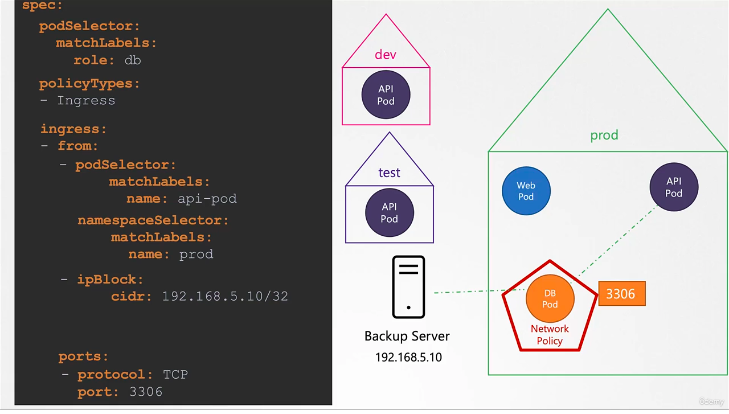

Here, we will work on network policies in more details

*credit kodekloud*

our goal is to protect the db pod and make sure that it doesn't allow connection form any other pods exerpt from the API pod on port 3306

the resource we want to protect is the db pod. So we should defile the policyTypes from the perspective of the db pod

*credit kodekloud*

to specify from what namespace is allowd to reach the db pod

*credit kodekloud*

*credit kodekloud*

if not specified 

*credit kodekloud*

those are the 3 selector available on the from (egress section)

interpret elemnents under the -from section

*credit kodekloud*

### egress
instead of a backup srv initiating a backup operation,  we write a job that trigger the operation from the db pod and send the generated file to the backeup server.

*credit kodekloud*

all selector viewed on the ingress are still available here