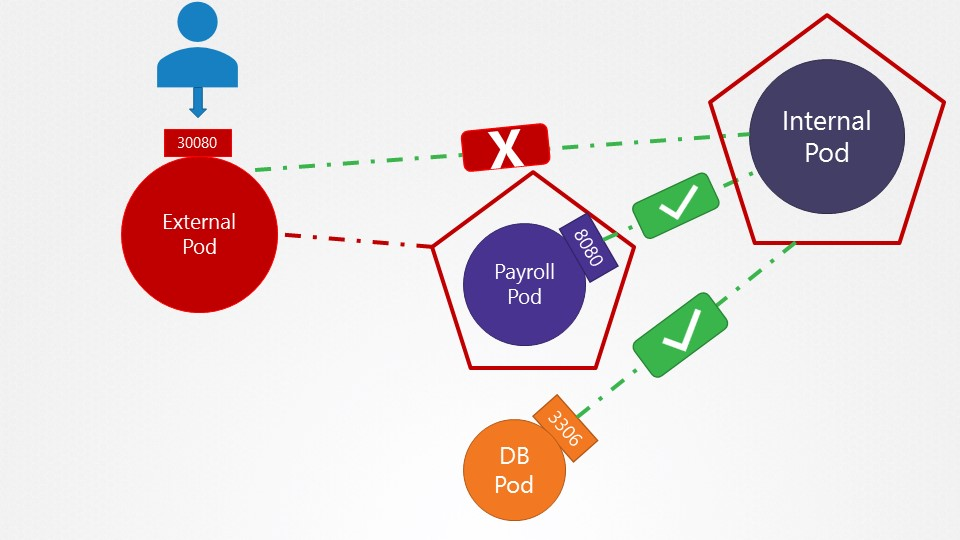

### k8s Practice Tests

----

##### Network Policies - Lab

1-
How many network policies do you see in the environment?

We have deployed few web applications, services and network policies. Inspect the environment. : `1`
```BASH 
k get networkpolicies.networking.k8s.io --no-headers | wc -l
```


2-
What is the name of the Network Policy? : `payroll-policy`
```BASH 
k get networkpolicies.networking.k8s.io --no-headers
payroll-policy   name=payroll   8m11s
```


3-
Which pod is the Network Policy applied on? : `payroll`
```BASH 
kubectl get networkpolicy

kubectl get po --show-labels | grep name=payroll
NAME             POD-SELECTOR   AGE
payroll-policy   name=payroll   3m36s
```


4-
What type of traffic is this Network Policy configured to handle? : `Ingress`
```BASH
k get networkpolicies.networking.k8s.io payroll-policy -o=yaml > payroll-policy.yaml

cat payroll-policy.yaml
cat payroll-policy.yaml 
apiVersion: networking.k8s.io/v1
kind: NetworkPolicy
metadata:
  annotations:
    kubectl.kubernetes.io/last-applied-configuration: |
      {"apiVersion":"networking.k8s.io/v1","kind":"NetworkPolicy","metadata":{"annotations":{},"name":"payroll-policy","namespace":"default"},"spec":{"ingress":[{"from":[{"podSelector":{"matchLabels":{"name":"internal"}}}],"ports":[{"port":8080,"protocol":"TCP"}]}],"podSelector":{"matchLabels":{"name":"payroll"}},"policyTypes":["Ingress"]}}
  creationTimestamp: "2025-03-29T14:50:59Z"
  generation: 1
  name: payroll-policy
  namespace: default
  resourceVersion: "5427"
  uid: e07d2387-0118-495d-a6d8-20237785d29e
spec:
  ingress:
  - from:
    - podSelector:
        matchLabels:
          name: internal
    ports:
    - port: 8080
      protocol: TCP
  podSelector:
    matchLabels:
      name: payroll
  policyTypes:
  - Ingress
```


5-
What is the impact of the rule configured on this Network Policy? : `Traffic From Internal to payroll pod is allowed`
```bash
```


6-
What is the impact of the rule configured on this Network Policy? : `Internal POD can access port 8080 on Payroll POD`
```bash
```

7-
Access the UI of these applications using the link given above the terminal.
```bash
```


8-
Perform a connectivity test using the User Interface in these Applications to access the `payroll-service` at port `8080`. : `Only Internal application can access payroll service.`
```bash
```


9-
Perform a connectivity test using the User Interface of the Internal Application to access the external-service at port 8080. : `Successefull`
```bash
```


10-
Create a network policy to allow traffic from the Internal application only to the payroll-service and db-service.

Use the spec given below. You might want to enable ingress traffic to the pod to test your rules in the UI.

Also, ensure that you allow egress traffic to DNS ports TCP and UDP (port 53) to enable DNS resolution from the internal pod.



```bash
cat internal-policy.yaml

apiVersion: networking.k8s.io/v1
kind: NetworkPolicy
metadata:
  name: internal-policy
  namespace: default
spec:
  podSelector:
    matchLabels:
      name: payroll
  policyTypes:
    - Egress
  egress:
    - to:
      - podSelector:
          matchLabels:
            name: payroll
      - podSelector:
          matchLabels:
            name: mysql
      ports:
        - protocol: TCP
          port: 8080
        - protocol: TCP
          port: 3306

```


###### Conclusion